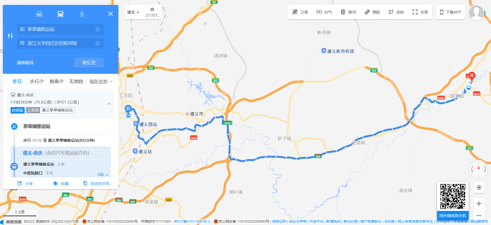
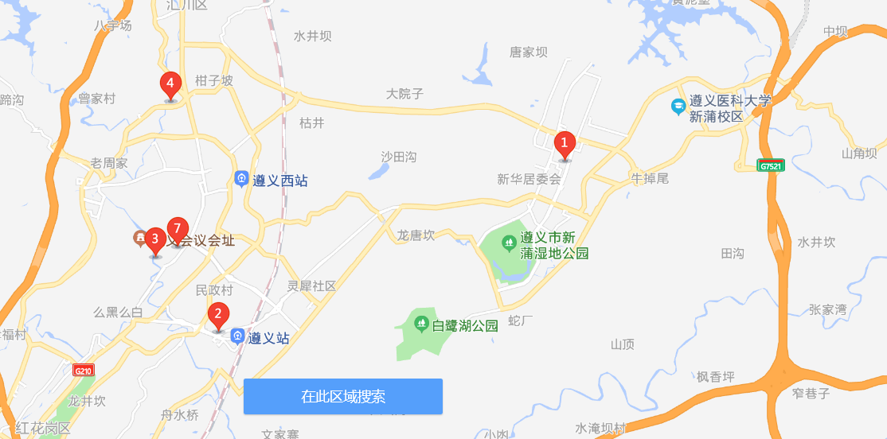
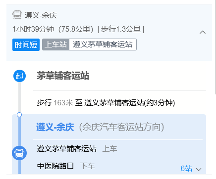
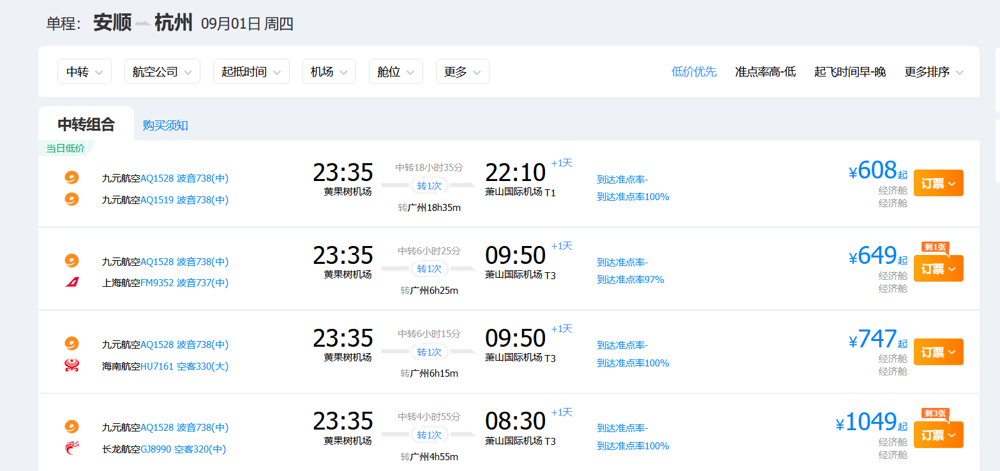

# 行程（待定）

## 8.24

晚上从杭州走，9点到遵义（建议南航）

然后住一个晚上（建议汉庭）

## 8.25 & 8.26

赶早八的车去湄潭（==湄潭没有火车==，只能做大巴）大约10点到纪念馆

然后这一圈似乎都可以拍摄、参观，协和医院、纪念碑、陈列馆、小学、司令部旧址，附近找个地方住一宿

## 8.27

day2晚上可以坐车回遵义住，也可以day3早上坐车

遵义一日游，大概去一下遵义会议旧址，晚上去贵阳（车次巨多）

## 8.28 & 8.29

一天青岩古镇(公交2h可到达)，一天黔灵山+贵州博物馆（公交都可以到达）

贵州博物馆主要是看看有没有和西迁相关的东西，或者扯点民族特色（装作自己不是来旅游的）

## 8.30

前往千户苗寨（火车+汽车）

建议住一晚第二天早上再走

## 8.31 & 9.1

可以直接去黄果树，也可以先去逛逛龙宫景区。这个具体看劳累情况和锅锅多少

（黄果树机场时间比较阴间，还要换机，建议回贵阳飞杭州）

