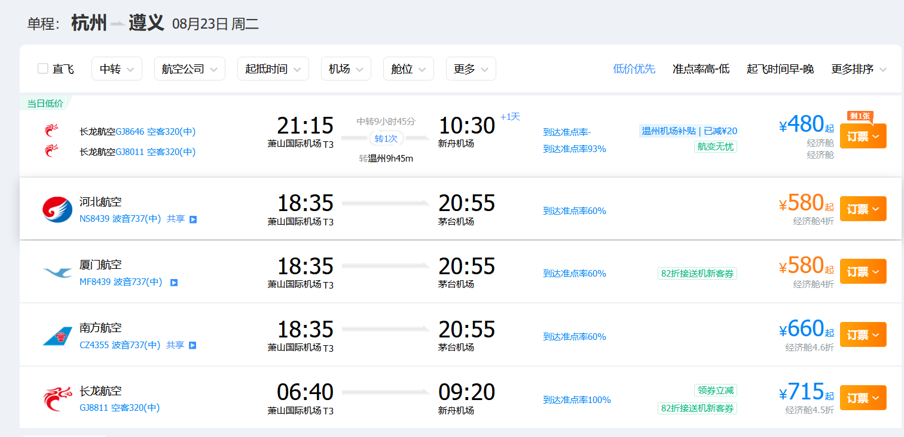

# 行程（待定）

## 8.24

晚上从杭州走，9点到茅台机场

坐机场巴士到仁怀天豪酒店，参考[知乎](https://www.zhihu.com/question/289136279#:~:text=%E8%8C%85%E5%8F%B0%E6%9C%BA%E5%9C%BA%E5%9C%A8%E4%BB%81%E6%80%80%E5%B8%82%EF%BC%8C%E9%81%B5%E4%B9%89%E6%96%B0%E8%88%9F%E6%9C%BA%E5%9C%BA%E5%9C%A8%E9%81%B5%E4%B9%89%E5%B8%82%E3%80%82,%E4%B8%A4%E4%B8%AA%E5%B8%82%E7%9A%84%E8%B7%9D%E7%A6%BB%E5%A4%A7%E6%A6%82%E5%9C%A81%E4%B8%AA%E5%B0%8F%E6%97%B6%E5%B7%A6%E5%8F%B3%E3%80%82)

然后住一个晚上

## 8.25 & 8.26

赶早八的车去湄潭（==湄潭没有火车==，只能做大巴）大约10点到纪念馆，[茅草铺客运站发车时间表](https://www.59178.com/qiche/checi/1310.htm)

25，26 住在纪念馆附近，把拍摄任务结束之后再回遵义市区玩。

然后这一圈似乎都可以拍摄、参观，协和医院、纪念碑、陈列馆、小学、司令部旧址，附近找个地方住一宿

## 8.27

day2晚上可以坐车回遵义住，也可以day3早上坐车

遵义一日游，大概去一下遵义会议旧址，晚上去贵阳（车次巨多）

## 8.28 & 8.29

一天青岩古镇(公交2h可到达)，一天黔灵山+贵州博物馆（公交都可以到达）

贵州博物馆主要是看看有没有和西迁相关的东西，或者扯点民族特色（装作自己不是来旅游的）

## 8.30

前往千户苗寨（火车+汽车）

建议住一晚第二天早上再走

## 8.31 & 9.1

可以直接去黄果树，也可以先去逛逛龙宫景区。这个具体看劳累情况和锅锅多少

（黄果树机场时间比较阴间，还要换机，建议回贵阳飞杭州）

